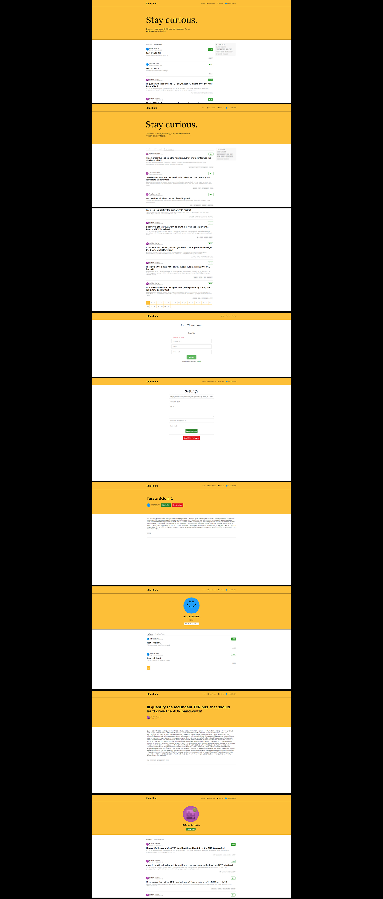

# Веб-приложение - платформа для блогов

Платформа для ведения блогов, размещения статей  
**Год:** 2023

## Внешний вид

## Реализовано:
- SPA на Angular в соответствии с техническим заданием;
- Вёрстка всех страниц и создание переиспользуемых компонентов и модулей;
- Реализация функционала платформы для ведения блогов и размещения статей (регистрация/авторизация, отображение/просмотр/фильтрация статей, личный кабинет, добавление/редактирование/удаление статей)
- Использование технологии NgRx для организации и управлением состояния приложения;
- Interceptor для удобства работы с jwt-токенами.

## Возможности:
* Регистрация, авторизация пользователя;
* Просмотр статей авторов, их фильтрация по тегам;
* Пагинация;
* Изменение данных пользователя в личном кабинете (имя, почта, биография, аватар);
* Написание статей, их редактирование и удаление;
* Оставление реакций на статьи.

## Используемые технологии:
* Angular (HTML, SCSS, TypeScript)
* NgRx
* RxJS
* Prettier
* JWT-Авторизация